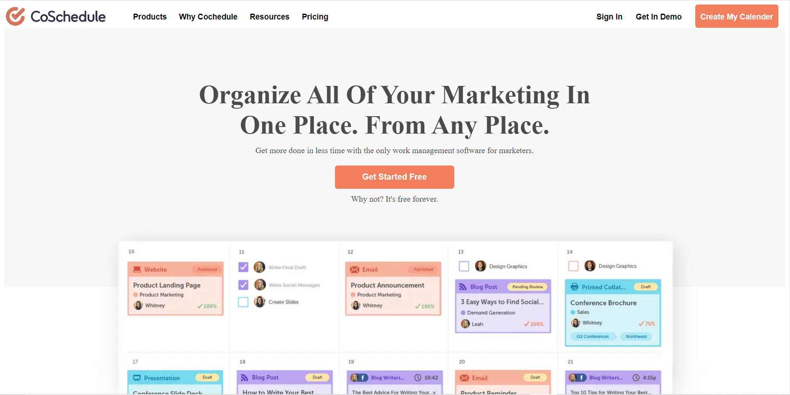
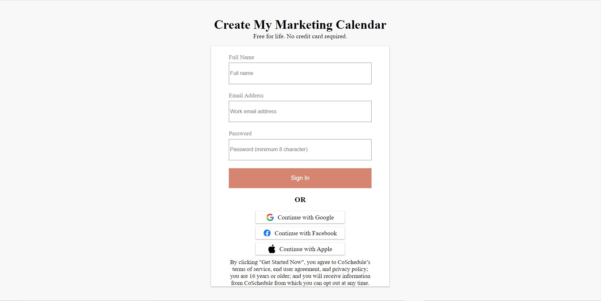

<h1 align="center" id="title">CoSchedule</h1>

<p id="description">Provide marketers with tools &amp; training that are uniquely helpful fun to use &amp; consistently punch above their weight.</p>


<h2>🚀 Demo</h2>

[Click to see demo](https://lucky-brigadeiros-2a2c5f.netlify.app/)

<h2>Project Screenshots:</h2>




  
  
<h2>🧐 Features</h2>

Here're some of the project's best features:

*   Login
*   SignUp

<h2>🛠️ Installation Steps:</h2>

<p>1. Step 1</p>

```
git clone https://github.com/Jubershaikh2307/selective-drawer-3054.git
```

  
  
<h2>💻 Built with</h2>

Technologies used in the project:

*   HTML
*   CSS
*   JavaScript
